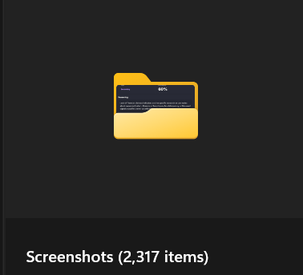
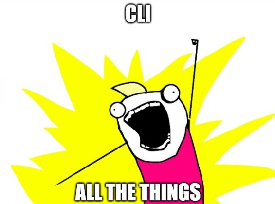

# SSC Screenshot Cleanup

`ssc` is a Windows-first CLI that classifies screenshots as important vs disposable, then reports, moves, or deletes low-value captures with budget controls.

## About This Project

Not sure about you, but after using coding CLIs for a while I end up with thousands of screenshots.



I ain't cleaning all that up myself. Let the CLIs do it! Install ScreenShotCleanup.



## Features

- Interactive setup and uninstall: `ssc --install`, `ssc --uninstall`
- Codex/Copilot provider support with configurable command templates
- Cache by `path + mtime + size` to reduce repeated model calls
- Daily budget controls for model calls and cleanup actions
- `--aggressive` mode for more disposable-biased classification
- Windows Task Scheduler integration: `ssc schedule install|status|run-now|uninstall`
- Hook shim generation for Codex and Copilot

## Install

From npm:

```powershell
npm install -g ssc-screenshot-cleanup
```

From GitHub:

```powershell
npm install -g github:mattgauzza/ssc-screenshot-cleanup
```

Run setup:

```powershell
ssc --install
```

## Quick Start

```powershell
ssc --install
ssc run --oldest-first --action report
```

Apply cleanup after preview:

```powershell
ssc run --oldest-first --aggressive --action move --yes
```

## Commands

```text
ssc --install
ssc --uninstall

ssc init [--config <path>]
ssc run [folder] [--provider codex|copilot] [--model <name>] [--action report|move|delete]
        [--max-files <n>] [--min-size-kb <n>] [--threshold <0-1>] [--concurrency <n>]
        [--oldest-first|--newest-first] [--aggressive]
        [--force] [--yes] [--verbose] [--config <path>]
ssc run-daily [folder] [--provider codex|copilot] [--model <name>] [--action report|move|delete]
              [--max-files <n>] [--oldest-first|--newest-first] [--aggressive] [--verbose] [--config <path>]

ssc schedule install [--time <HH:mm>] [--task-name <name>] [--folder <path>]
                     [--provider codex|copilot] [--model <name>] [--action report|move|delete]
                     [--max-files <n>] [--oldest-first|--newest-first] [--aggressive] [--verbose] [--config <path>]
ssc schedule status [--task-name <name>]
ssc schedule run-now [--task-name <name>]
ssc schedule uninstall [--task-name <name>]

ssc install [--target codex|copilot|both]
            [--codex-dir <path>] [--copilot-dir <path>]
            [--script-name <name>] [--force] [--no-prompt] [--config <path>]
ssc uninstall [--target codex|copilot|both]
              [--codex-dir <path>] [--copilot-dir <path>]
              [--script-name <name>] [--clear-manifest] [--no-prompt] [--config <path>]

ssc config get [--config <path>]
ssc config set <key> <value> [--config <path>]
ssc help
```

## Behavior Notes

- `ssc run` defaults to report mode unless `--action move|delete` is set.
- `ssc run` requires `--yes` for file-changing actions.
- `ssc run` uses `sortOrder` from config unless overridden by `--oldest-first` or `--newest-first`.
- `ssc run-daily` enforces `daily.maxModelCallsPerDay` and `daily.maxActionsPerDay`.
- `ssc run-daily` auto-confirms move/delete when daily action is set to `move` or `delete`.
- `--force` bypasses cache and reclassifies files.
- `--verbose` prints provider commands and (if present) sampled provider error reasons.
- For Copilot image runs in compatibility mode, verbose output masks prompt text as `-p <prompt>`.

## Aggressive Mode

`--aggressive` makes cleanup more assertive:

- Applies a disposable-biased prompt addendum
- Uses a lower default threshold (capped at `0.35`) unless `--threshold` is explicitly provided
- For `ssc run`, defaults action to `move` when `--action` is omitted
- For `ssc run-daily`, defaults that invocation's action to `move` when `--action` is omitted

## Recommended Settings

If you want the lowest-cost routine profile, use Copilot with `gpt-5-mini`.

```powershell
ssc config set providers.copilot.enabled true
ssc config set provider copilot
ssc config set providers.copilot.model gpt-5-mini
ssc config set daily.sortOrder oldest
ssc config set daily.action move
ssc config set daily.maxModelCallsPerDay 8
ssc config set daily.maxActionsPerDay 8
```

Optional dry-run check:

```powershell
ssc run --provider copilot --model gpt-5-mini --oldest-first --action report --max-files 25 --force --verbose
```

If your machine cannot find `copilot`, set the full command path:

```powershell
ssc config set providers.copilot.command "C:\full\path\to\copilot.cmd"
```

If `gpt-5-mini` is not recognized in your Copilot CLI, use `gpt-5` instead.

## Provider Compatibility

Copilot and Codex can require different invocation styles for image classification.

- Codex path uses native image argument support (for example `--image`).
- Copilot path uses compatibility mode when needed:
  - single prompt arg (`-p`)
  - `--yolo`
  - `--allow-all-paths`
  - `--add-dir <screenshots-dir>`
  - `--output-format json`

If Copilot output is unusable for an image (for example truncated/incomplete responses), SSC can fall back to Codex per file when Codex is enabled.

## Output Formatting

Recent versions add clearer terminal formatting:

- Spaced sections: `Run Summary`, `Disposable Candidates`, and provider error samples
- Colored labels in interactive terminals (TTY) for info/warn/error/success

If your shell does not render colors, force-enable ANSI colors:

```powershell
$env:FORCE_COLOR = "1"
```

## Automation

### Hook scripts (Codex/Copilot)

`ssc --install` can create shim scripts under your CLI folders (for example `~/.codex` and `~/.copilot`) that call `ssc run-daily`.

If your Codex/Copilot setup supports hooks, point the hook command to the generated `.cmd` shim.

### Windows Task Scheduler

```powershell
ssc schedule install --time 09:30 --aggressive --action move --max-files 20 --oldest-first
ssc schedule status
ssc schedule run-now
ssc schedule uninstall
```

Notes:

- Scheduler commands are Windows-only.
- Default task name: `SSC Screenshot Cleanup Daily`
- `--time` must be `HH:mm` (24-hour format)
- `run-now` requires the task to exist (install first)

## Configuration

Default config path on Windows:

`%APPDATA%\screenshot-cleanup\config.json`

Other files:

- Cache: `%APPDATA%\screenshot-cleanup\cache.json`
- Daily usage state: `%APPDATA%\screenshot-cleanup\daily-state.json`
- Install manifest: `%APPDATA%\screenshot-cleanup\install-manifest.json`

Useful keys:

- `defaultFolder`
- `sortOrder`
- `importanceThreshold`
- `action`
- `provider`
- `providers.codex.*` / `providers.copilot.*`
- `daily.*`
- `installer.*`

Provider output must resolve to JSON with:

```json
{"important": true, "confidence": 0.82, "reason": "short reason"}
```

If output is nested, set `outputJsonPath`.

## Development

```powershell
npm install
npm run check
```

## License

MIT
